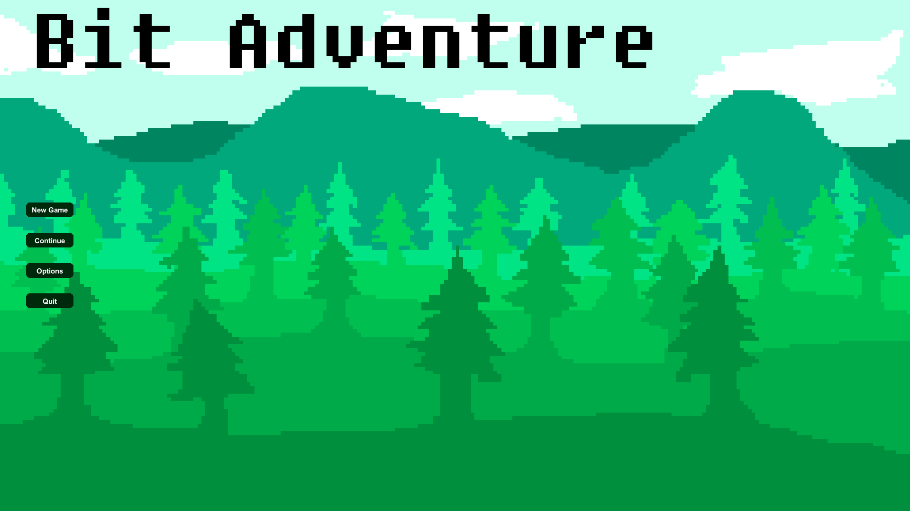

  
<h1 align="center"> Bit Adventure </h1>

<p2 align="center"> 
This game was created for a Game Studio class in County College of Morris as a final project. The project consisted in designing, developing, advertising and publishing a game in a span of 7 weeks. This game is a open world bullet hell shooter that has you complete quests while improving your equipment and level by random drops from slaying monsters.
  
 
</p2>

  
Features: 

* Bullet Hell Combat Mechanics
* Questing System 
* Player Leveling System
* Dialogue System
* Inventory System
* Enemy AI

  
  
  
  <h3 align="center"> Itch.io download page: https://sebastianjungle.itch.io/bit-adventure </h3>
   
